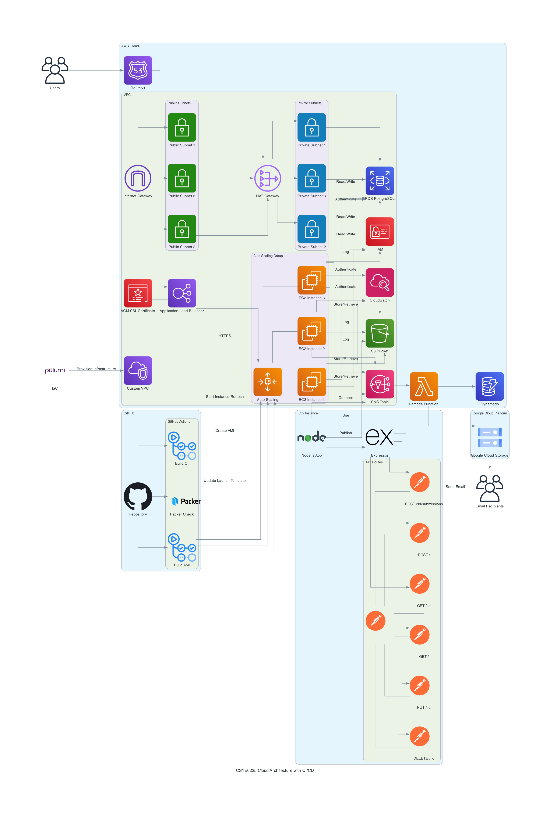

# CSYE6225 Cloud Architecture

This repository contains the architecture diagram for the CSYE6225 cloud-based application infrastructure.

## Architecture Diagram

## Overview

This diagram illustrates the cloud infrastructure for our application, showcasing the integration of various AWS services and external components to create a scalable, secure, and robust environment.

## Key Components

### AWS Cloud Infrastructure

1. **VPC (Virtual Private Cloud)**
   - Custom VPC with public and private subnets across multiple Availability Zones
   - Internet Gateway for public internet access
   - NAT Gateway for private subnet internet access

2. **Compute**
   - Auto Scaling Group with EC2 instances
   - Application Load Balancer for traffic distribution

3. **Database**
   - RDS PostgreSQL instance in private subnet

4. **Storage**
   - S3 Bucket for application data

5. **Security**
   - IAM roles and policies for EC2 and Lambda
   - Security groups for EC2, RDS, and Load Balancer
   - ACM SSL Certificate for HTTPS

6. **Monitoring and Logging**
   - CloudWatch for monitoring and alarms

7. **Serverless**
   - Lambda function integrated with SNS

8. **DNS**
   - Route 53 for domain management

### External Services

1. **Google Cloud Platform**
   - Google Cloud Storage for additional data storage

2. **GitHub**
   - Repository for source code
   - GitHub Actions for CI/CD pipeline

3. **Infrastructure as Code**
   - Pulumi for infrastructure provisioning

## Application Stack

- Node.js with Express.js
- API routes for CRUD operations

## Security Considerations

- All sensitive components (e.g., RDS) are placed in private subnets
- HTTPS is enforced for all external communications
- IAM roles are used for EC2 instances and Lambda functions

## Scalability and Reliability

- Auto Scaling Group ensures application availability and performance
- Multi-AZ deployment for high availability
- Load Balancer distributes traffic across multiple EC2 instances

## Contributing

For any suggestions or improvements to the architecture, please open an issue or submit a pull request.

## License

This project is licensed under the MIT License - see the [LICENSE.md](LICENSE.md) file for details.
